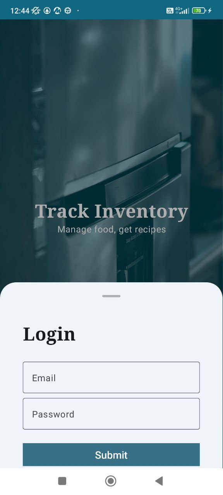
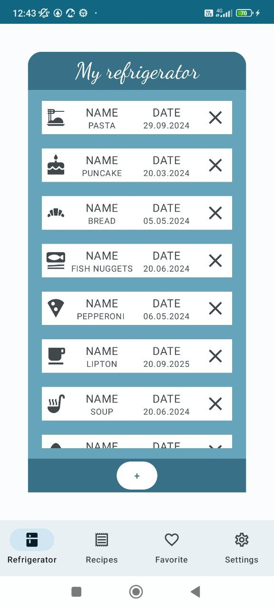
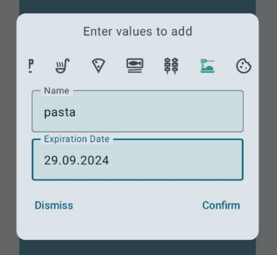
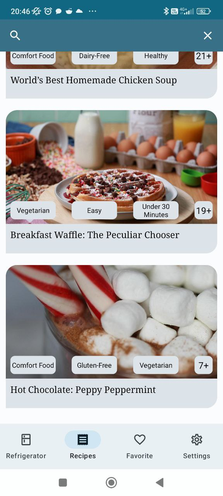
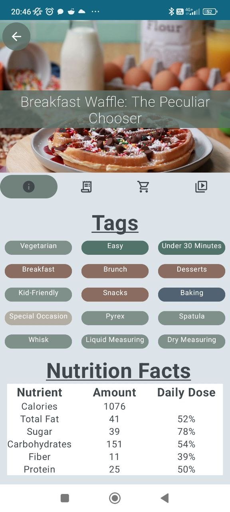
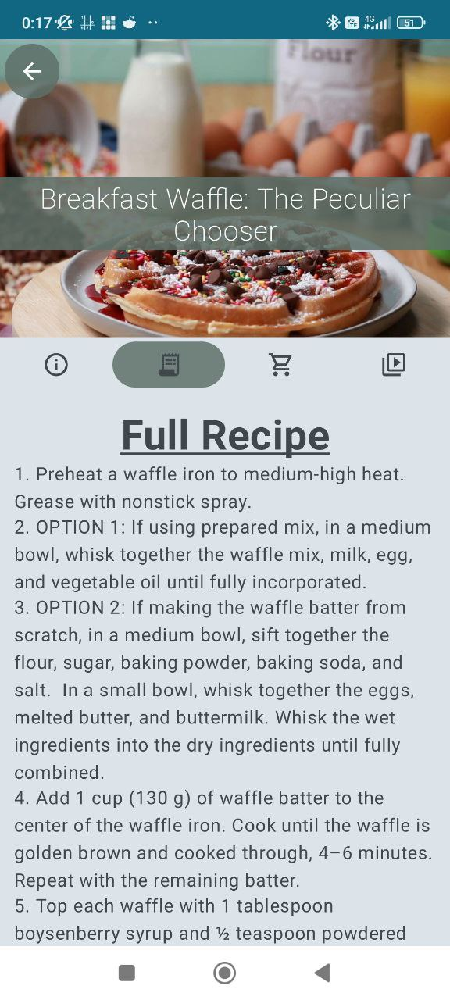
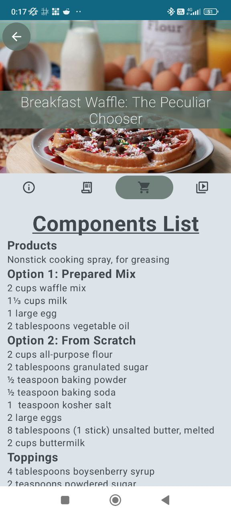

Документация пользователя для приложения TasteTips
# Введение:
Приложение преднозначено для удобного отслеживания продуктов холодильника пользователем. Пользователь заносит информацию о необходимых продуктов с указанием даты просрочки, и по истечению срока годности получает уведомления.

## Регистрация и вход в приложение  

На главном экране приложения находятся кнопки Login и Register для авторизации и регистрации соответственно.  

  

## Отображаемый список продуктов  

  

## Добавление продукта в список  

Пользователь может самостоятельно добавлять и удалять позиции из списка  

  

## Экран с рецептами

## Информация о рецепте  

    
  
  

